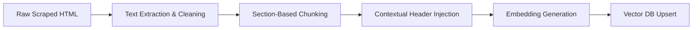

# Architecture: Chunking & Embedding Pipeline

This document details the technical implementation of the data transformation layer, which converts raw scraped HTML from Groww into searchable vector representations.

---

## 1. Pipeline Workflow

---

## 2. Chunking Strategy

To ensure high retrieval accuracy for mutual fund data, we employ a **Context-Aware Recursive Chunking** approach.

### A. Cleaning & Pre-processing
*   **Noise Removal**: Stripping `<script>`, `<style>`, and navigation elements.
*   **Structure Preservation**: Converting HTML tables into Markdown format to maintain structural integrity for the LLM.

### B. Recursive Splitting
*   **Logic**: Split by headers (`h1`, `h2`, `h3`), then by paragraphs, then by sentences.
*   **Parameters**:
    *   **Chunk Size**: 600 characters (approx. 100-150 tokens). Small chunks are preferred for specific facts like "Exit Load".
    *   **Chunk Overlap**: 100 characters to ensure sentences aren't cut mid-fact.

### C. Contextual Injection (Critical Step)
Every chunk is prefixed with a global context header to prevent the "lost in middle" problem:
> **Metadata Header**: `[Scheme: HDFC Mid-Cap Opportunities Fund | Source: Groww]`  
> **Chunk Content**: "The exit load is 1% if redeemed within 1 year..."

---

## 3. Embedding Implementation

### A. Model Selection
*   **Model**: `BAAI/bge-base-en-v1.5`.
*   **Rationale**: 
    *   **Superior Accuracy**: Significantly higher retrieval performance than MiniLM models.
    *   **Dimensions**: 768-dimensional vectors (standard for base-sized models).
    *   **v1.5 Improvements**: Optimized for better handling of diverse text lengths and technical financial terms.

### B. Batch Processing
*   Scraped data is processed in batches of 32 chunks to optimize CPU/Memory usage during the GitHub Action execution.

---

## 4. Structured Data Storage

To ensure the LLM has access to precise, non-hallucinated numbers for the 5 key metrics, we use a **Dual-Storage Strategy**:

### A. Metadata Enrichment (Vector DB)
The following fields are extracted from the Groww JSON and attached to **every chunk** related to that scheme in the Vector Database:
*   `nav`: Current Net Asset Value.
*   `min_sip`: Minimum SIP amount.
*   `fund_size`: Total Assets Under Management (AUM).
*   `expense_ratio`: Annual fee percentage.
*   `rating`: Morningstar/Groww star rating.

**Benefit**: When the retriever pulls a chunk about "Exit Load", it also passes the current `nav` and `expense_ratio` to the LLM, ensuring the answer is always up-to-date even if the specific text chunk doesn't mention them.

### B. Summary Fact Sheet (JSON/CSV)
A standalone `latest_facts.json` is generated daily in `data/processed/`. This serves as a "Source of Truth" for structured queries and debugging.

---

## 5. Vector Database Management
*   **Database**: ChromaDB (Local Persistent Storage).
*   **Storage Path**: `./data/vector_db`.
*   **Strategy**: **Purge and Reload**. Before inserting new data for a specific scheme (e.g., HDFC Mid-Cap), all existing vectors with that `scheme_name` metadata are deleted to ensure data freshness.

---

## 6. GitHub Actions Integration
The pipeline runs daily:
1.  **Checkout Code**.
2.  **Install Dependencies**.
3.  **Run Scraper** (`src/ingestion/scraper.py`).
4.  **Run Chunking & Processing** (`src/ingestion/processor.py`).
5.  **Run Embedding & Vector DB Update** (`src/ingestion/embedder.py`).
6.  **Persist Changes**: The local `data/vector_db` is updated on the runner. (Note: For long-term persistence in GitHub Actions, the database would typically be uploaded as an artifact or pushed back to the repo).
