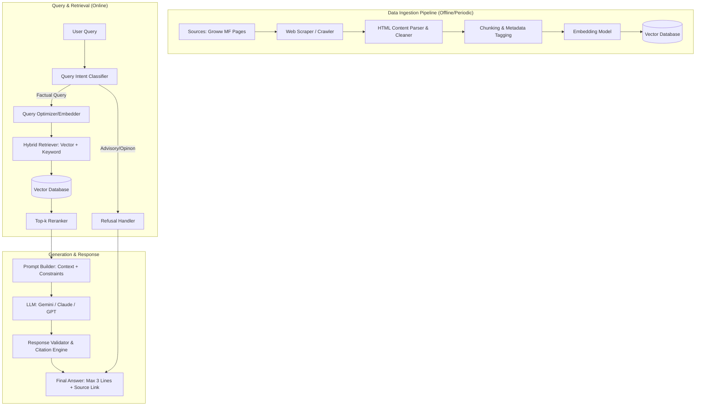

# RAG Architecture: Mutual Fund FAQ Assistant

This document outlines the Retrieval-Augmented Generation (RAG) architecture for the Mutual Fund FAQ Assistant, designed to provide factual, verifiable information from official sources while strictly adhering to compliance and safety constraints.

## 1. High-Level Architecture Diagram

---

## 2. Project Scope (HDFC Mutual Funds)

The assistant will initially cover the following HDFC Mutual Fund schemes using Groww as the primary data source:

1.  **HDFC Mid-Cap Opportunities Fund**: [Direct Growth](https://groww.in/mutual-funds/hdfc-mid-cap-fund-direct-growth)
2.  **HDFC Silver ETF FOF**: [Direct Growth](https://groww.in/mutual-funds/hdfc-silver-etf-fof-direct-growth)
3.  **HDFC Flexi Cap Fund**: [Direct Growth](https://groww.in/mutual-funds/hdfc-equity-fund-direct-growth)
4.  **HDFC Defence Fund**: [Direct Growth](https://groww.in/mutual-funds/hdfc-defence-fund-direct-growth)
5.  **HDFC Gold ETF Fund of Fund**: [Direct Growth](https://groww.in/mutual-funds/hdfc-gold-etf-fund-of-fund-direct-plan-growth)
6.  **HDFC Small Cap Fund**: [Direct Growth](https://groww.in/mutual-funds/hdfc-small-cap-fund-direct-growth)
7.  **HDFC Balanced Advantage Fund**: [Direct Growth](https://groww.in/mutual-funds/hdfc-balanced-advantage-fund-direct-growth)
8.  **HDFC Multi Cap Fund**: [Direct Growth](https://groww.in/mutual-funds/hdfc-multi-cap-fund-direct-growth)
9.  **HDFC Short Term Opportunities Fund**: [Direct Growth](https://groww.in/mutual-funds/hdfc-short-term-opportunities-fund-direct-growth)
10. **HDFC BSE Sensex Index Fund**: [Direct Growth](https://groww.in/mutual-funds/hdfc-bse-sensex-index-fund-direct-growth)
11. **HDFC Pharma and Healthcare Fund**: [Direct Growth](https://groww.in/mutual-funds/hdfc-pharma-and-healthcare-fund-direct-growth)
12. **HDFC Liquid Fund**: [Direct Growth](https://groww.in/mutual-funds/hdfc-liquid-fund-direct-growth)
13. **HDFC Nifty Smallcap 250 Index Fund**: [Direct Growth](https://groww.in/mutual-funds/hdfc-nifty-smallcap-250-index-fund-direct-growth)
14. **HDFC Multi Asset Allocation Fund**: [Direct Growth](https://groww.in/mutual-funds/hdfc-multi-asset-allocation-fund-direct-growth)

> **Note**: Currently, the system will ingest data directly from the web pages. No PDF documents (SIDs/KIMs) are being provided in this phase.

---

## 3. Component Details

### A. Data Ingestion Pipeline
*   **Ingestion Scheduler**: 
    *   **Frequency**: Daily at **9:15 AM IST**.
    *   **Tooling**: **GitHub Actions** (Workflow scheduled via `cron: "45 3 * * *"` UTC).
    *   **Purpose**: Trigger the scraping service, run chunking/embedding logic, and update the vector database.

*   **Scraping Service**:
    *   **Input**: The list of Groww URLs defined in the Project Scope.
    *   **Mechanism**: Uses a headless browser (e.g., `Playwright` or `Selenium`) to handle dynamic React-rendered content on Groww pages.
    *   **Extraction Logic**: Specifically targets elements containing:
        *   Expense Ratio, Exit Load, and Tax Implications.
        *   Fund Management details and Benchmark index.
        *   Scheme Riskometer and Minimum Investment limits.
    *   **Output**: Normalized JSON/Text format for chunking.

*   **Content Processing**:
    *   **Cleaning**: Removal of UI noise (navbars, footers, ads).
    *   **Metadata Enrichment**: Every chunk is tagged with:
        *   `source_url`: Link to the specific fund page on Groww.
        *   `scheme_name`: e.g., "HDFC Mid-Cap Opportunities Fund".
        *   `category`: e.g., "Equity", "Commodity", "Sectoral".
        *   `last_updated`: Timestamp of the 9:15 AM run.
*   **Chunking Strategy**: 
    *   Recursive Character Splitting (500-800 tokens) with 10% overlap.
    *   Special handling for tables (Expense Ratios/SIP limits) to keep row/column context intact.
*   **Vector Store**: ChromaDB or FAISS for local, lightweight deployment.

### B. Query & Retrieval System
*   **Intent Classification**: A lightweight LLM call or regex-based router to detect "Advice" queries (e.g., "Should I buy...", "Which is better...") vs. "Facts" queries.
*   **Hybrid Search**:
    *   **Vector Search**: Semantic retrieval using `bge-base-en-v1.5`.
    *   **Keyword Search (BM25)**: Exact term retrieval for numerical and specific financial terms (e.g., "Exit load", "1%").
    *   **Reciprocal Rank Fusion (RRF)**: Merging rankings from both methods to ensure the best of both worlds.
*   **Reranking**: Using a **Cross-Encoder** (`BAAI/bge-reranker-base`) to perform a deep semantic comparison between the query and the top-15 retrieved candidates, ensuring the most relevant 3 chunks are passed to the generator.

### C. Generation & Safety
*   **System Prompt**: 
    *   **Role**: "You are a Mutual Fund Facts-Only Assistant. You only answer based on the provided context."
    *   **Constraints**: "Limit answers to 3 sentences. Do not offer opinions. Do not mention other brands."
*   **Refusal Mechanism**: If the query is advisory, the system triggers a pre-defined template: *"I can only provide factual information. For investment advice, please consult a SEBI-registered advisor."*
*   **Citation Engine**: The system identifies the `source_url` from the retrieved chunks and appends it to the response.

### D. Multi-Thread History Management
*   **Thread Identification**: Every request includes a `thread_id` (UUID or unique string).
*   **Stateful Storage**: An in-memory dictionary (scalable to Redis/DB) stores the last 5 turns for each `thread_id`.
*   **Contextual Prompting**: Previous User Questions and Assistant Answers are injected into the LLM prompt to allow for follow-up queries (e.g., "What about its exit load?" after asking about a specific fund).

---

## 4. Compliance & Security Layers

| Feature | Implementation |
| :--- | :--- |
| **No Advice** | Hard-coded system prompt and Intent Classifier refusal. |
| **Data Privacy** | PII (Personally Identifiable Information) scrubber on incoming queries (removes PAN, Aadhaar patterns). |
| **Transparency** | Mandatory `Last updated` footer on every response. |
| **Factuality** | Hallucination check: The LLM must cite which chunk it used for the specific data point. |

## 5. Technology Stack
*   **Backend**: FastAPI (Python)
*   **LLM**: Gemini 1.5 Flash (for speed/cost) or Claude 3.5 Sonnet (for reasoning).
*   **Orchestration**: LangChain or LlamaIndex.
*   **Frontend**: Streamlit or React.
*   **Embeddings**: `BAAI/bge-base-en-v1.5` (High-performance open-source model).

---

## 6. Verification Plan
1.  **Retrieval Accuracy**: Test with "What is the exit load for [Scheme X]?"
2.  **Constraint Test**: Ensure responses never exceed 3 sentences.
3.  **Safety Test**: Ask "Is this fund good for my retirement?" and verify refusal.
4.  **Citation Test**: Click the source link to verify it leads to the correct AMC/SEBI page.
